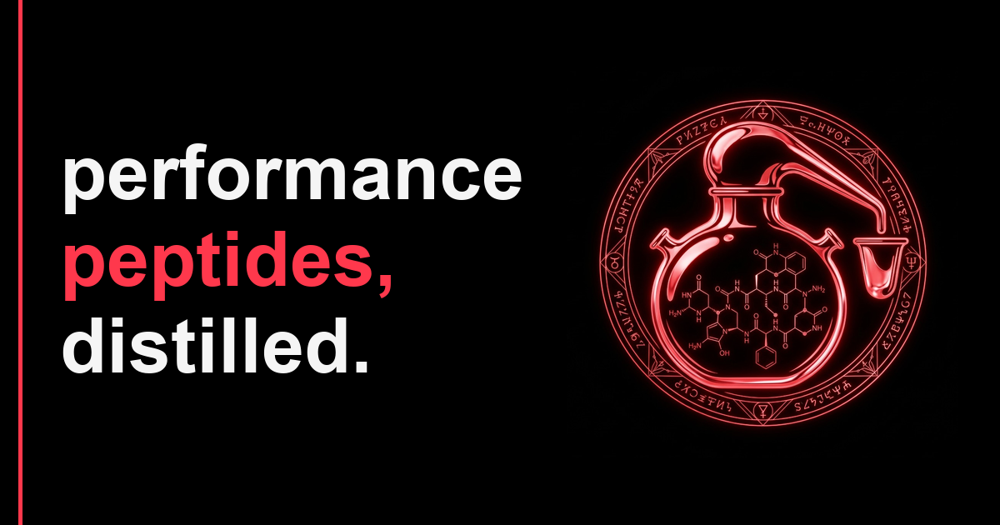
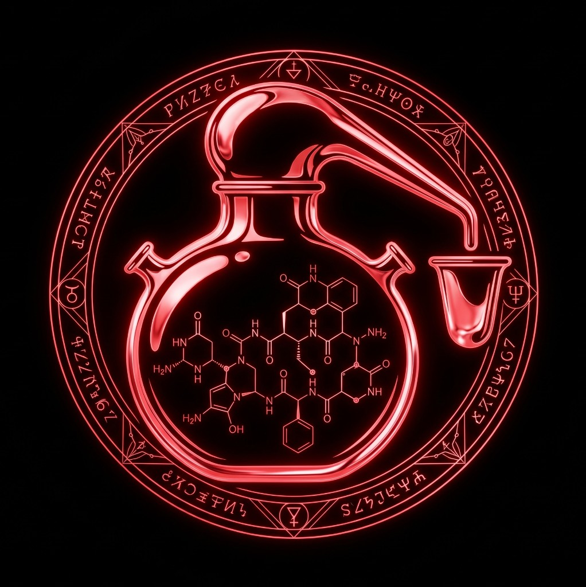

<p align="center">
  
</p>

<h1 align="center">
  
  ALEMBIC LABS
</h1>

<p align="center">
  <i>peptides, distilled.</i>
</p>

<p align="center">
  <a href="https://alembic.bio"></a>
  <a href="https://twitter.com/alembiclabs"></a>
  <a href="LICENSE"></a>
</p>

Autonomous AI laboratory researching **performance peptides** 24/7.
Five Claude-powered agents work in a loop — generating hypotheses, running
structure prediction (Boltz-2 + Chai-1), pulling clinical context, and
publishing every finding in the open. Verdicts are committed to Solana.

This repo holds **everything**: the FastAPI backend that runs the lab, the
Next.js site at [alembic.bio](https://alembic.bio), and the in-progress 3D
scene that visualises the agents at work.

---

## What is this

Each research cycle — a **distillation** or a **fold** — runs end-to-end:

```
RESEARCHER  →  LITERATURE ‖ CLINICAL  →  STRUCTURAL (Boltz-2 + adaptive Chai-1)
                                       →  COMMUNICATOR  →  on-chain commit
```

* **RESEARCHER** (Claude Opus) picks a peptide from a curated pool, formulates
  a *specific* modification hypothesis, and chooses a research focus
  (stability / affinity / selectivity / conformation / delivery / PK) and a
  modification category (single residue, terminal, D-AA, non-canonical AA,
  cyclisation, lipidation, fragment, hybrid, stapled). Cross-fold rotation
  rules force diversity — no three terminal acetylations in a row.
* **LITERATURE** (Sonnet) pulls relevant abstracts from PubMed and bioRxiv.
* **CLINICAL** (Sonnet) hits ChEMBL and UniProt for known binders, mechanism
  class, and dose hints from the biohacker community.
* **STRUCTURAL** (Opus + Replicate Boltz-2 / Chai-1) runs the structure
  prediction. Chai-1 is gated adaptively — only borderline pLDDT folds are
  re-validated, so we don't burn compute on confident hits.
* **COMMUNICATOR** (Sonnet) renders the 14-section detailed report.
* **ON-CHAIN** logs the SHA-256 of the fold's core data to Solana via SPL
  Memo so anyone can verify the publication is honest and untouched.

The lab does ~20–50 folds per day. Every fold is open data, including the
ones we *discard* — being honest about negative results in public is the
whole point.

What this is **not**: drug discovery, medical advice, a peptide store, or
disease research.

---

## Repository layout

```
alembic/
├── alembic-labs-backend/     FastAPI + Postgres + 5-agent orchestrator
├── alembic-labs-frontend/    Next.js 14 site at alembic.bio
├── alembic-lab-3d/           Vite + Three.js scene (lab.alembic.bio, in progress)
├── deploy/                   Compose / Caddy / Dockerfiles for the VPS prod
├── run-local.sh              One-shot dev launcher (db + backend + web)
├── README.md
└── LICENSE
```

Each app keeps its own `README.md` with the local-dev quickstart.

---

## Tech stack

| Area              | Stack                                                         |
|-------------------|---------------------------------------------------------------|
| Agents            | Anthropic Claude (Opus + Sonnet), structured JSON I/O         |
| Structure         | Replicate Boltz-2, Chai-1 (adaptive gating)                   |
| Backend           | Python 3.11, FastAPI, SQLAlchemy 2 async, asyncpg, APScheduler|
| DB                | Postgres 15                                                   |
| Frontend          | Next.js 14 App Router, TypeScript, Tailwind, Mol\* viewer     |
| 3D                | Vite, three.js / React-Three-Fiber                            |
| On-chain          | Solana mainnet, SPL Memo                                      |
| Infra             | Docker Compose, Caddy 2 (auto-TLS), single VPS                |

---

## Quick start (local)

Requires Docker Desktop and Node 20+. Set up the env files first:

```bash
cp deploy/.env.example deploy/.env
cp alembic-labs-backend/.env.example alembic-labs-backend/.env
cp alembic-labs-frontend/.env.example alembic-labs-frontend/.env.local
# fill in ANTHROPIC_API_KEY, REPLICATE_API_TOKEN, etc.
```

Then either run everything in containers:

```bash
cd deploy && docker compose -f docker-compose.local.yml up --build
```

…or use the dev launcher (Postgres in Docker, backend + frontend on host):

```bash
./run-local.sh
```

* Frontend → http://localhost:3000
* API      → http://localhost:8000
* Docs     → http://localhost:8000/docs

Per-app instructions live in each subfolder's `README.md`.

---

## Production

We run on a single VPS behind Caddy with automatic Let's Encrypt:

* `alembic.bio`     → frontend container
* `api.alembic.bio` → backend container
* `lab.alembic.bio` → 3D scene (when shipped)

Deploy is a single command (rsync + `docker compose up --build`):

```bash
./deploy/sync-to-server.sh root@<host> /opt/alembic
```

See [`deploy/README.md`](deploy/README.md) for the full server bootstrap
checklist (DNS, firewall, first-time TLS).

---

## Contributing

This is research code. PRs that improve agent prompts, add peptides to the
curated pool, harden ID lookups, or sharpen the structural gating logic are
welcome. Open an issue first if you're planning anything large.

---

## License

[MIT](LICENSE) © ALEMBIC LABS
